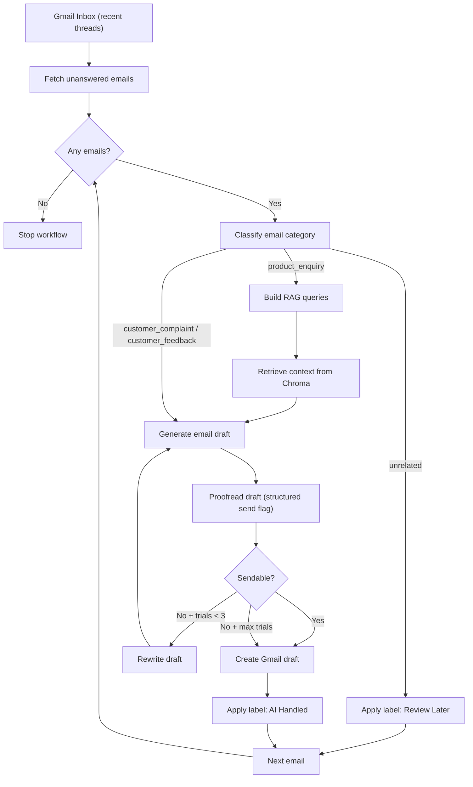

# Email Automation Platform (AI + Gmail + LangGraph)

An AI-powered email automation system that connects to Gmail, reads incoming customer emails, classifies intent, drafts high-quality replies, and organizes inbox threads with smart labels.

This project includes:
- A **LangGraph orchestration engine** for multi-step AI decision flow
- A **FastAPI web app** with Gmail OAuth login and dashboard
- **RAG-powered responses** for product enquiries using a local Chroma vector store
- **Gmail automation** for draft creation, optional send flow, and thread labeling

---

## Overview

Customer-facing teams (especially e-commerce and startups) lose time and revenue handling repetitive emails manually.  
This platform automates the support pipeline:

1. Fetches unanswered Gmail threads
2. Classifies each email (`product_enquiry`, `customer_complaint`, `customer_feedback`, `unrelated`)
3. Uses internal knowledge retrieval (RAG) for product questions
4. Generates and proofreads response drafts
5. Creates Gmail drafts and labels threads:
   - `AI Handled` for processed support/product threads
   - `Review Later` for unrelated threads

---

## What Problem This Solves

- Repetitive product/support queries consume team bandwidth
- Slow response times reduce conversion and customer trust
- Manual triage is inconsistent and error-prone
- Teams need safe automation with control (draft-first, approval mindset)

This system reduces repetitive work while keeping humans in the loop where needed.

---

## Features

- Gmail OAuth login and token management
- Unanswered-thread detection (avoids re-processing drafted threads)
- AI email classification with structured outputs
- Product enquiry handling with RAG context retrieval
- Draft generation + proofreader validation loop
- Retry/rewrite flow with capped attempts
- Smart Gmail labels (`AI Handled`, `Review Later`)
- Dark SaaS web UI:
  - Landing page
  - Dashboard with metrics, inbox tabs, and AI side panel
- API endpoints to run workflow and fetch inbox previews

---

## Tech Stack

### Languages
- Python 3
- HTML, CSS, JavaScript

### Backend / APIs
- FastAPI
- Uvicorn
- LangServe
- Google Gmail API (`google-api-python-client`)
- Google OAuth (`google-auth-oauthlib`)

### AI / Orchestration
- LangGraph
- LangChain
- Groq (`llama-3.3-70b-versatile`) for classification/writing/proofreading
- HuggingFace embeddings (`sentence-transformers/all-MiniLM-L6-v2`)
- ChromaDB vector store (RAG)

### Frontend
- Jinja2 templates
- Vanilla JS
- Custom dark SaaS CSS design system

---

## APIs and External Services

- **Gmail API**
  - Read recent emails
  - List/create drafts
  - Modify message labels
  - Optional send replies
- **Groq API**
  - LLM inference for agent tasks
- **Google OAuth 2.0**
  - User authorization and token lifecycle
- **(Optional) Google Gemini API**
  - Used in `create_index.py` test chain only

---

## Project Structure

```text
langgraph-email-automation/
├── app.py                      # Main FastAPI web app (OAuth, pages, API routes)
├── main.py                     # CLI workflow runner
├── deploy_api.py               # LangServe endpoint wrapper
├── create_index.py             # Build/update Chroma vector store from local docs
├── requirements.txt            # Python dependencies
├── .env.example                # Environment variable template
├── data/
│   └── agency.txt              # Knowledge base source text for RAG
├── db/                         # Chroma persisted index files
├── templates/
│   ├── index.html              # Landing page
│   └── dashboard.html          # Dashboard page
├── static/
│   ├── style.css               # Shared styles
│   ├── landing.css             # Landing page premium theme
│   ├── dashboard.css           # Dashboard dark SaaS theme
│   ├── app.js                  # Legacy generic UI script
│   └── dashboard.js            # Dashboard logic (tabs, API calls, panel)
└── src/
    ├── graph.py                # LangGraph workflow definition
    ├── nodes.py                # Workflow node logic
    ├── agents.py               # LLM/RAG chain setup
    ├── prompts.py              # Prompt templates
    ├── state.py                # Graph state schema
    ├── structure_outputs.py    # Pydantic structured outputs
    └── tools/
        └── GmailTools.py       # Gmail API operations + labels
```

---

## Workflow Diagram



---

## How It Works (End-to-End)

1. User connects Gmail via OAuth in the web app (`/auth/gmail`).
2. OAuth callback stores credentials into `token.json`.
3. Dashboard (`/dashboard`) can show inbox previews via `/api/emails`.
4. User triggers automation via `/api/run-workflow` (or runs `main.py`).
5. Workflow engine:
   - Loads unanswered emails from last 8 hours
   - Classifies category
   - For product enquiries: builds RAG queries and fetches context from Chroma
   - Writes draft and proofreads it
   - Rewrites up to retry limit if needed
   - Creates Gmail draft
   - Applies labels (`AI Handled` or `Review Later`)
6. API returns step trace for UI status display.

---

## Setup Instructions

### 1) Prerequisites
- Python 3.10+ recommended
- Gmail API enabled in Google Cloud
- OAuth client credentials (`credentials.json`)
- Groq API key

### 2) Install dependencies

```bash
python3 -m venv venv
source venv/bin/activate
pip install -r requirements.txt
```

If you hit embedding import errors, also ensure:

```bash
pip install sentence-transformers
```

### 3) Environment variables

Create `.env` using `.env.example`:

```env
GROQ_API_KEY=your_groq_api_key_here
MY_EMAIL=your.email@gmail.com
# GOOGLE_API_KEY=your_google_api_key_here
# OAUTH_REDIRECT_URI=http://localhost:8000/auth/callback
```

### 4) Add OAuth credentials

Place `credentials.json` in project root.  
For web login flow, configure Google OAuth redirect URI:

`http://localhost:8000/auth/callback`

### 5) Build vector index (RAG)

```bash
python3 create_index.py
```

Ensure your knowledge base file exists at `data/agency.txt`.

---

## Run Modes

### A) Web App (recommended)

```bash
python3 app.py
```

Open:
- Landing: `http://localhost:8000`
- Dashboard: `http://localhost:8000/dashboard`

### B) CLI Workflow

```bash
python3 main.py
```

### C) LangServe API

```bash
python3 deploy_api.py
```

---

## Usage Guide

1. Open web app and click **Connect Gmail**.
2. Complete Google consent.
3. Open dashboard.
4. Click **Activate** to run full workflow.
5. Check Gmail:
   - Draft replies created for support/product threads
   - `AI Handled` label on processed threads
   - `Review Later` label on unrelated emails

---

## Example Flow (Realistic)

**Incoming Email**  
Subject: “Do you have a yearly pricing plan?”  
Body: “We are comparing tools for our team of 15. Do you offer annual billing discounts?”

**System actions**
1. Classifies as `product_enquiry`
2. Generates RAG query from intent
3. Retrieves pricing policy context from `db/` (built from `data/agency.txt`)
4. Draft writer composes response
5. Proofreader validates quality
6. Gmail draft is created in same thread
7. Thread gets label: `AI Handled`

---

## API Details (Web App)

Base URL: `http://localhost:8000`

### Page Routes
- `GET /` → Landing page
- `GET /dashboard` → Dashboard page
- `GET /auth/gmail` → Start OAuth
- `GET /auth/callback` → OAuth callback + save token

### JSON API
- `GET /api/auth/status`
  - Returns login status from token presence
- `GET /api/emails`
  - Returns recent unanswered email previews
- `POST /api/run-workflow`
  - Runs the workflow and returns execution steps/errors

Example response:

```json
{
  "success": true,
  "steps": [
    "load_inbox_emails",
    "check_new_emails",
    "categorize_email",
    "construct_rag_queries",
    "retrieve_from_rag",
    "email_writer",
    "email_proofreader",
    "send_email"
  ]
}
```

---

## Security Notes

- `token.json` and `credentials.json` are ignored in `.gitignore`
- OAuth-based Gmail access (no password collection)
- Gmail scope currently uses `gmail.modify`
- You can revoke access anytime from Google Account permissions

---

## Future Improvements

- Persistent multi-tenant architecture (per-company config and data isolation)
- Real auto-reply daemon while toggle is ON (background scheduler/worker)
- True action handlers for dashboard buttons (`Approve`, `Edit`, `Regenerate`)
- Confidence scoring based on model outputs
- Analytics persistence and charts (processed, approvals, SLA)
- Queueing and retries using Celery/RQ + Redis
- Role-based access control and audit logs

---

## Contributing

Contributions are welcome.

Suggested workflow:
1. Fork the repo
2. Create a feature branch
3. Make focused changes with tests (if applicable)
4. Open a pull request with clear description

---

## License

This project currently has no explicit license file in the repository.  
If you plan to distribute or commercialize it, add a `LICENSE` file (for example MIT, Apache-2.0, or a proprietary license) before release.

